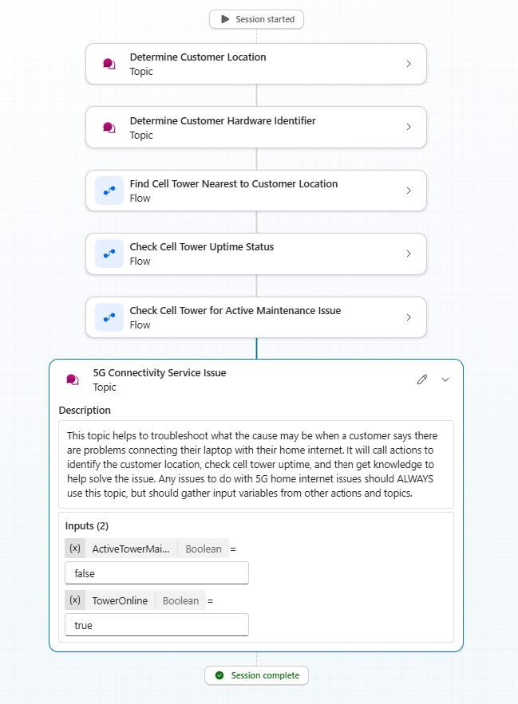
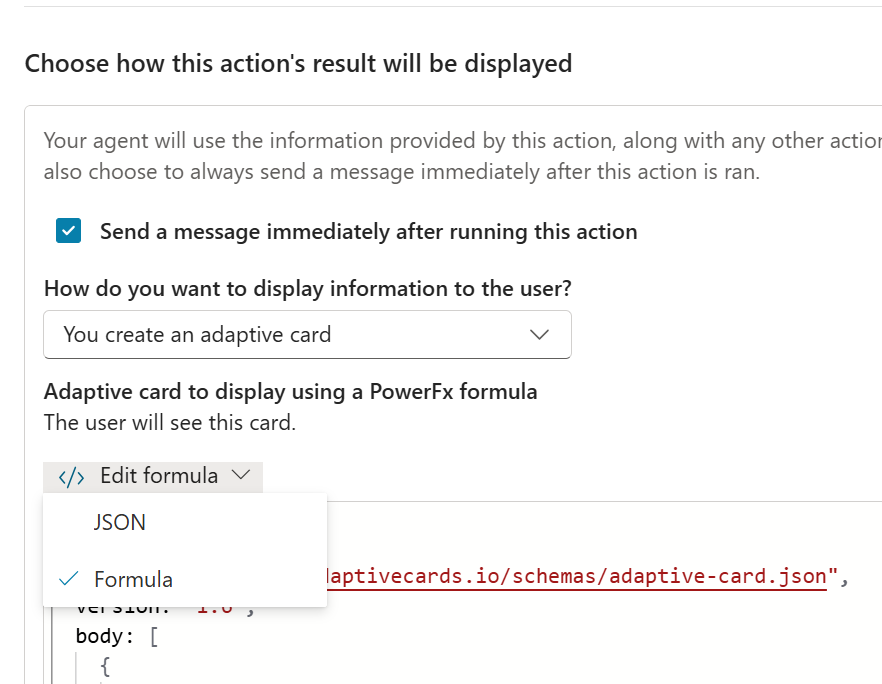
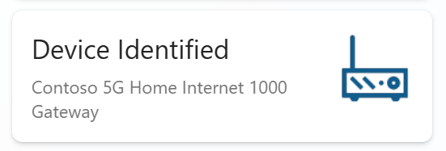
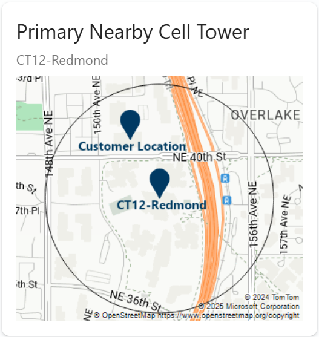
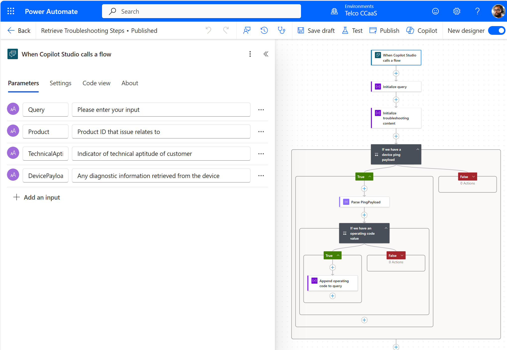
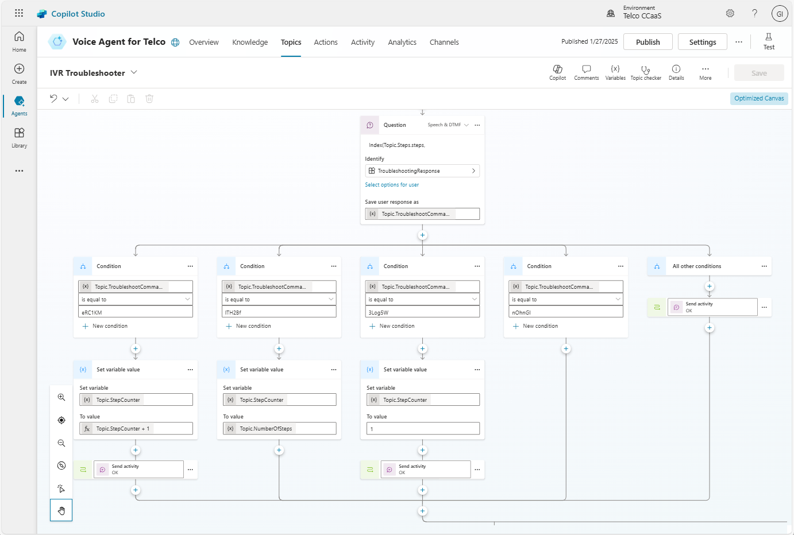
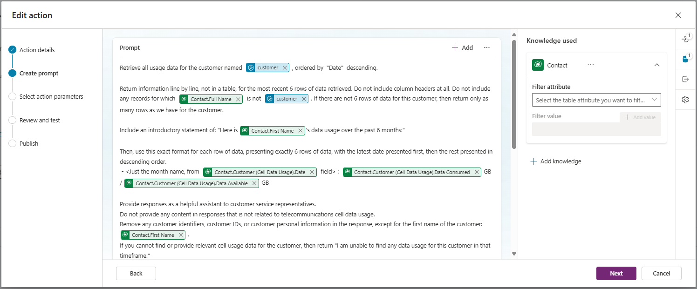
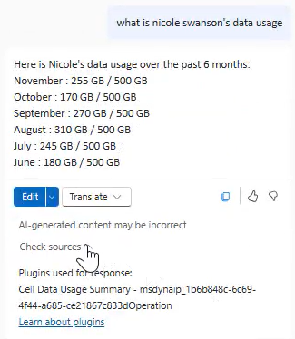
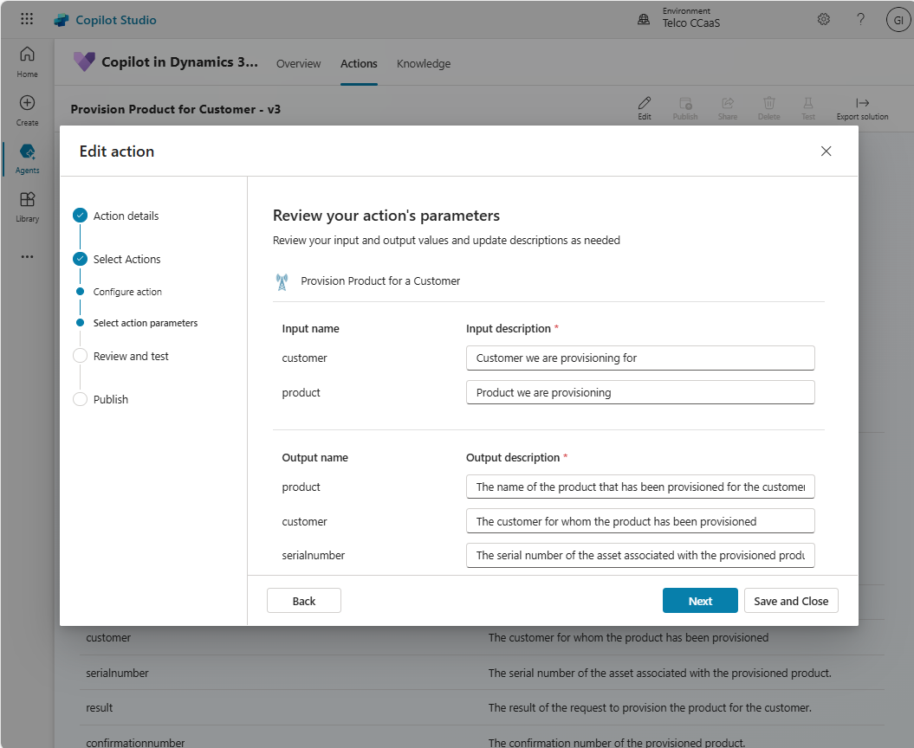
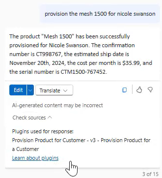

# Differentiators

There are several capabilities that were focused on as key capabilities and differentiators for this accelerator. Their usage and business value is discussed here.

Those capabilities include:

 * [GenAI-based Orchestration of Topics and Actions in Copilot Studio](#genai_orchestration)
 * [Dynamically-generated Adaptive Cards in Topics and Actions](#adaptive_cards)
 * [Dynamically-generated Azure Maps Images in Adaptive Cards](#azure_maps)
 * [Dynamically-generated Troubleshooting Steps in Copilot Studio Topics](#troubleshooting_steps)
 * [Prompt Plugins for Copilot in D365 Customer Service](#prompt_plugins)
 * [Connector Plugins for Copilot in D365 Customer Service](#connector_plugins)


<a id="genai_orchestration"></a>
## GenAI-based Orchestration of Topics and Actions in Copilot Studio

A key capability demonstrated in this solution accelerator is the ability to orchestrate agent behavior with generative AI. When enabled, this allows the agent to make a plan of action, and then execute that action, based on the Topics, Actions, and Knowledge that are available to it.

With this accelerator, when the customer tells the agent that they are having trouble connecting to their home internet, the agent typically will identify that it will need to leverage the **5G Connectivity Service Issue** Topic.

This topic, however, has two Input variables: **TowerOnline** and **ActiveTowerMaintenanceIssue**. There are other Actions that are available to the agent that will enable it to obtain these input variable values as outputs; and those actions in turn have their own input variables that can be obtained from other Actions and Topics.

As a result, the agent dynamically assembles and executes the topics and actions sequentially, in an automated manner, and only requesting input from the customer when needed. 

### Example of Completed Plan in Activity Maps


As outlined in the [feature documentation](https://learn.microsoft.com/en-us/microsoft-copilot-studio/advanced-generative-actions), the key to enabling the agent to successfully create and execute an action plan is to ensure an accurate and detailed description of the Actions, Topics and Knowledge, as well as relevant descriptions of all Input and Output variables that Actions and Topics have. These descriptions are leveraged to help the agent in assembling a relevant plan.


<a id="adaptive_cards"></a>
## Dynamically-generated Adaptive Cards in Topics and Actions

When building agents in Copilot Studio, one of the tools available to create compelling experiences for end users is the ability to present Adaptive Cards.

Adaptive Cards are an open card exchange format enabling developers to exchange UI content in a common and consistent way.  Adaptive Cards are simple JSON objects that describe user interface cards that can include text, images, buttons, and more.

They can readily be created using a drag and drop interface in the [Adaptive Cards Designer](https://adaptivecards.io/designer/).

Once they have been created in the designer (or other tools), then can be presented to users in Topic Messages (by selecting **+Add > Adaptive card** in a Message node), used to gather information from the user (by adding an **Ask with an adaptive card** node to a topic), or displayed as an Action result (by selecting the **Send a message immediately after running this action**, and choosing **You create an adaptive card** option, on the **Outputs** tab of the Action).

The value of Adaptive Cards is enhanced when they are populated with dynamic data that is relevant to the end user or conversation. This is achieved by choosing the **Formula** option for defining the card, and authoring a formula that will return the desired JSON for your card, with variables populated.

This is an example of opting to enter a Power FX formula to define an Adaptive Card to be presented as the result of an Action:



When creating your Power FX formula to produce your Adaptive Card content, you can include variable values that are available in your Action or Topic.

For example, one of the Adaptive Cards that is presented in the accelerator (when testing the agent in Text chat mode) is this one, that displays the customer device that has been dynamically identified via a Power Automate flow:



In this instance, a flow named **Retrieve Customer Devices by Info Provided** returns a string of JSON data. That string is then parsed using a Parse JSON node, and turned into an object that contains an array of devices. The first device is selected, and it's name is inserted into the Adaptive Card with the Power FX formula component **First(Topic.Devices.devices).DeviceName**.

You can find the full Power FX formula for rendering this Adaptive Card [here](../AdaptiveCards_PowerFXFormulas/CustomerDeviceAdaptiveCard.txt), and you can find all other formulas used in this accelerator in the [AdaptiveCards_PowerFXFormulas](../AdaptiveCards_PowerFXFormulas/) folder.


<a id="azure_maps"></a>
## Dynamically-generated Azure Maps Images in Adaptive Cards

When working with location-centric data in your agent, it can be beneficial, informative, and compelling to present location-based data to end users on a map.

[Azure Maps](https://azure.microsoft.com/en-us/products/azure-maps/) is an Azure service that includes a wealth of geospatial capabilities, including the ability to render static map images based on location information provided in an image URL.

In this accelerator, there are two Adaptive Cards that are dynamically created using Power FX formulas, with static map images also dynamically built using geospatial variable values. This Adaptive Card is used to present the location of nearest Cell Tower to the customer, along with the customer's location.



In building the URL for this map image, we are using the [Get Map Static Image rendering API](https://learn.microsoft.com/en-us/rest/api/maps/render/get-map-static-image).

We build a URL that includes several dynamic values:

 * **Text(Env.cto_AzureMapsKey)**
    * our Azure Maps Key (stored in Azure Key Vault as a secret, and consumed as an Environment variable in Copilot Studio) passed in for the **subscription-key** parameter
 * **Text(Topic.Output.celltowerlong)** and **Text(Topic.Output.celltowerlat)**
    * latitude and longitude values for the Cell Tower location, obtained from a Power Automate flow action, and passed in as the map centerpoint (**center** parameter), the location of one of the **pins**, and as the centerpoint of a circle in the **path** parameter
 * **Text(Topic.Input.number_1)** and **Text(Topic.Input.number)**
    * latitude and longitude values for the customer location, obtained as input variables, and used as the location of one of the **pins**
 * **Text(Topic.Output.celltowerid)**
    * the Cell Tower name, obtained as an input variable, and used as a label for one of the **pins**

The portion of the Power FX formula that generates the full map URL is shown below:
 ```
url: "https://atlas.microsoft.com/map/static?subscription-key=" & Text(Env.cto_AzureMapsKey) & "&zoom=14&tilesetId=microsoft.base.road&api-version=2024-04-01&language=en-us&center=" & Text(Topic.Output.celltowerlong) & "," & Text(Topic.Output.celltowerlat) & "&pins=default%7Cla15+50%7Cls12%7Clc003b61%7C%7C%27Customer%20Location%27" & Text(Topic.Input.number_1) & "%20" & Text(Topic.Input.number) & "|%27" & Text(Topic.Output.celltowerid) & "%27" & Text(Topic.Output.celltowerlong) & "%20" & Text(Topic.Output.celltowerlat) & "&height=300&width=350&path=ra450||" & Text(Topic.Output.celltowerlong) & "%20" & Text(Topic.Output.celltowerlat)
 ```

<a id="troubleshooting_steps"></a>
## Dynamically-generated Troubleshooting Steps in Copilot Studio Topics

In this accelerator, once the Copilot Studio orchestration has determined that there are no network issues that would be responsible for the issue the customer is facing, the agent makes use of a dynamic troubleshooting capability in the **IVR Troubleshooter** Topic.

Rather than hardcoding troubleshooting steps into the nodes of a Topic in Copilot Studio, we are using a generic troubleshooting topic that can retrieve and walk through a sequence of steps that are retrieved and tailored to the specific customer and issue, based on several factors:
 * The issue that the customer has stated
 * The ID of the Device that we have identified
 * The technical aptitude of the customer
 * The response data retrieved when pinging the customer's device

These parameters are passed into a Power Automate flow, which is responsible for retrieving relevant information from the device ping payload, then searching for Knowledgebase articles or Case Resolutions that align to the issue, product, and operating status of the device.



Within the Power Automate flow, any relevant troubleshooting content is passed to a custom prompt, using the [AI Builder Create text with GPT using a prompt connector](https://learn.microsoft.com/en-us/ai-builder/use-a-custom-prompt-in-flow).


The custom prompt returns personalized troubleshooting instructions in JSON format, which are returned to our Copilot Studio topic.

We then use a step counter to allow our end user to step sequentially through the troubleshooting steps, ending, starting over, or repeating a step if needed.



Once the issue has been resolved, key information about the operating code and issue identified can also be used to dynamically retrieve any relevant upsell opportunities that align to the issue at hand.


<a id="prompt_plugins"></a>
## Prompt Plugins for Copilot in D365 Customer Service

Copilot in Dynamics 365 Customer Service offers compelling out-of-the-box capabilities for summarizing conversations, interaction timelines, cases, and more.

In addition, it can be extended to allow it to work with industry-specific or organization-specific data and line of business applications, through the creation of [Plugins](https://learn.microsoft.com/en-us/dynamics365/customer-service/administer/enable-copilot-plugins-for-generative-ai).

[Prompt Plugins](https://learn.microsoft.com/en-us/dynamics365/customer-service/administer/enable-copilot-plugins-for-generative-ai#prompt-plugin) in particular offer solution configurers to build scenario specific prompts in AI Builder, tapping into and summarizing specific data from Dataverse tables.

This accelerator includes a Prompt Plugin that is able to retrieve and summarize data usage for a customer, retrieving it from a custom Dataverse table that contains data usage vs data allotment on a month by month basis.

The feature documentation provides an overview of the entire process of authoring and publishing prompt plugins, and here we will focus on the specifics of our cell data usage plugin.

The plugin is designed to retrieve content from the Cell Data Usage table (included with the solution in this accelerator) that contains these columns, amongst others:


When selecting the **Copilot in Dynamics 365 Customer Service** agent in Copilot Studio, and selecting the **Actions** tab, you can view existing Actions, or create new Prompt or Custom Connector Actions. The Prompt Plugin is defined as shown below, in Copilot Studio.

Note that, although the Cell Data Usage table is where our desired data resides, we specify that we will use the Contact table as our knowledge used, and we then retrieve the Cell Data Usage data through the relationship between the Contact table and the Cell Data Usage table. Each record in the Cell Data Usage table will have a field (**Customer**) which is a lookup on a contact in the Contact table.




After Turning On and Publishing your Action as a Plugin in the D365 Customer Service admin center, representatives with access to Copilot Studio and your Plugin will now be able to interact with the Prompt Plugin via Copilot:





<a id="connector_plugins"></a>
## Connector Plugins for Copilot in D365 Customer Service

In addition to Prompt Plugins, this accelerator makes use of a [Custom Connector Plugin](https://learn.microsoft.com/en-us/dynamics365/customer-service/administer/enable-copilot-plugins-for-generative-ai#custom-connector-plugin).

Custom Connector Plugins allow users of Copilot in D365 Customer Service to use natural language to interact with applications and data in non-Microsoft solutions and applications.

Custom Connectors extend the power of Copilot for streamlining employee productivity to extend to the types of applications that would normally require an agent to switch screens and context. Through natural language, representatives can retrieve data, or even execute transactions in these external systems.

In this accelerator, we are using a mocked-up API that allows for the provisioning of services to a customer, based on the input of a customer and a product.

In the Data folder, you will find the sample response from this API:

**Sample Request:** 
```
<url for API endpoint>?customer=Nicole Swanson&product=Mesh 1500
```

**Sample Response**
```json
{ 
    "product":"Mesh 1500", 
    "customer":"Nicole Swanson", 
    "estimatedshipdate":"November 20th, 2024", 
    "serialnumber":"CTM1500-767452", 
    "result":"The product has been successfully provisioned.", 
    "confirmationnumber":"CT998767", 
    "costpermonth":"$35.99" 
}
```

If desired, you may host this sample response payload in a static file, on a webserver, in a Power Pages page, or in Azure Blob Storage.

For an overview of Custom Connectors in the Power Platform, view the [documentation here](https://learn.microsoft.com/en-us/connectors/custom-connectors/).

This accelerator solution includes a Custom Connector named **Provision Product for Customer**:


To use the mocked-up API response included above, update the Request URL in the Custom Connector with the URL where you have hosted your sample JSON payload.

In Copilot Studio, when selecting the **Copilot in Dynamics 365 Customer Service** agent in Copilot Studio, selecting the **Actions** tab, then creating a new **Connector** Action, you can find your Custom Connector, and specify the Action you wish to make available. Input and Output parameters are specified and described, as shown below:



After Turning On and Publishing your Action as a Plugin in the D365 Customer Service admin center, representatives with access to Copilot Studio and your Plugin will now be able to interact with the Custom Connector API via Copilot:




